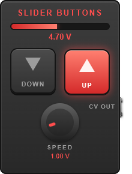

# Slider Buttons

[](https://github.com/Jesse-Hufstetler/slider-buttons/actions/workflows/build.yml)



An LV2 plugin for [MOD Devices](https://mod.audio/) hardware (built and tested against the MOD Dwarf) that turns two momentary buttons into a control voltage (CV) signal.

Hold **Up** and the output ramps up; hold **Down** and it ramps down. Release both and it holds its value. It's a "hold to raise or lower" voltage source, handy for sweeping a filter, volume or pitch from footswitches instead of a knob or expression pedal.

## Ports

| Port | Type | Range | Description |
|------|------|-------|-------------|
| Down Button | Control in (toggle, momentary) | 0–1 | While on, the output ramps down |
| Up Button | Control in (toggle, momentary) | 0–1 | While on, the output ramps up |
| Speed | Control in | 0–10 (default 1) | Ramp rate in volts per second |
| CV Output | CV out | 0–10 V | The current value |
| Output Value | Control out | 0–10 V | The same level as a control value, so the GUI can show a live meter |

The output is clamped to 0–10 V and starts at 0 V. If both buttons are held, they cancel out. The pedal GUI shows the level as a bar and a number.

## Building and installing

The build uses the MOD plugin builder toolchain. `redeploy.sh` sources its environment, builds the plugin, and pushes the bundle to a Dwarf over USB networking:

```bash
./redeploy.sh
```

It expects `~/mod-plugin-builder` to be set up for the `moddwarf` target and the device to be reachable at `192.168.51.1`.

For a plain build with the host compiler:

```bash
make
sudo make install   # installs to /usr/local/lib/lv2
```

## Files

- `slider-buttons.c`: the plugin code
- `slider-buttons.lv2/`: the LV2 bundle (`slider-buttons.ttl` describes the ports, `modgui.ttl` the GUI; `manifest.ttl` is generated from `manifest.ttl.in`)
- `Makefile`, `Makefile.mk`: build rules
- `redeploy.sh`: build and deploy to a MOD Dwarf

## Pedal GUI

`slider-buttons.lv2/modgui/` holds the plugin's MOD pedal GUI (HTML template, stylesheet, a level-meter script, screenshot and thumbnail). The artwork is original to this project and drawn entirely in CSS.

## License

[MIT](LICENSE)
